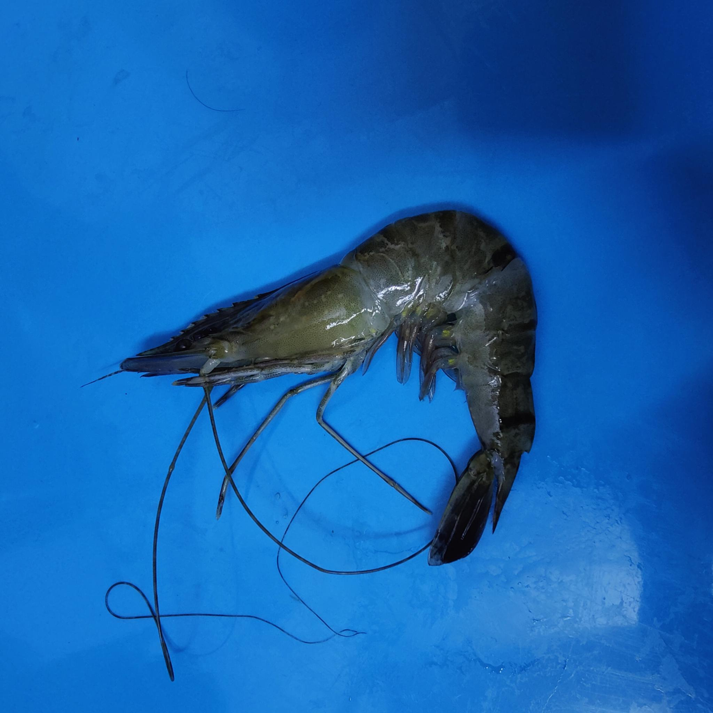
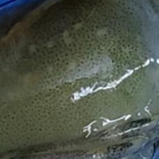
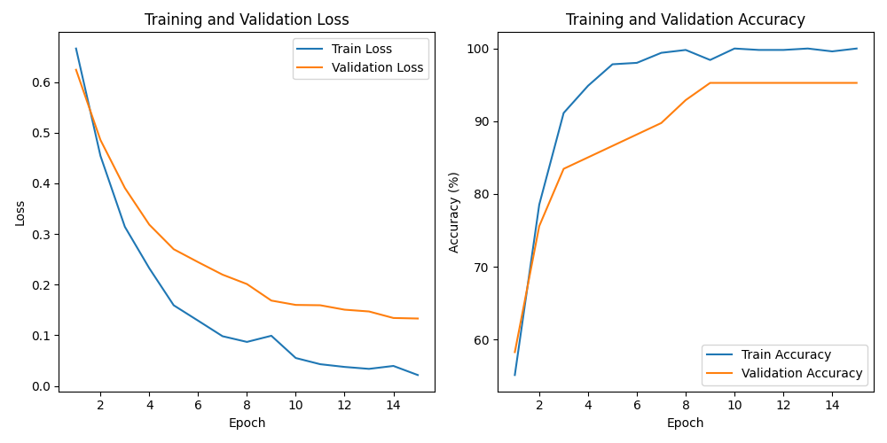

# Shrimp WSSV Classifier

Finetuning ResNet-18 (pretrained on ImageNet1k) to detect white spot syndrome virus (WSSV) in shrimp images.

ResNet-18 is limited by a 224x224 input image size. Cropping the shrimp images to a 224x224 section that often displays signs of the pathogen—the carapace—has a significant impact on the resulting loss. Training a second model to place a 224x224 bounding box over the carapace would be an effective way to eliminate the manual labour of cropping the original images.

### Uncropped WSSV Image


### Cropped WSSV Image


Training for ~10 minutes on an M1 Mac resulted in a 95% prediction accuracy on the validation set.

### Training Graph


## Setup
1. 
```
git clone https://github.com/ryandorrington/shrimp-wssv-classifier.git
cd shrimp-wssv-classifier
```
2. Install requirements
```
pip install -r requirements.txt
```
3. Train
```
python3 classification_model_train.py
```


Original dataset source: https://data.mendeley.com/datasets/jhrtdj9txm/3 - Islam, Mohammad Manzurul; Sarker, Anabil; Choudhury, Ashiquzzaman ; Ahmed, Noortaz ; Rasel, Ahmed Abdal Shafi Rasel (2025), "ShrimpDiseaseImageBD: An Image Dataset for Computer Vision-Based Detection of Shrimp Diseases in Bangladesh", Mendeley Data, V3, doi: 10.17632/jhrtdj9txm.3
